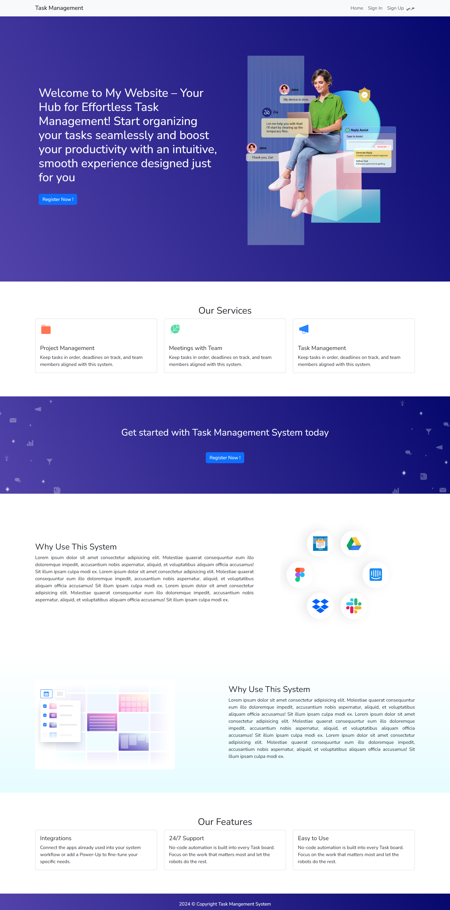

# Task Board

## Objective
Create a task board that allows users to assign tasks, set priorities, and define due dates. This application will enhance productivity by providing a clear visual representation of task progress and management.

## Key Features

### 1. Drag-and-Drop Interface
- Users can easily drag tasks between different columns such as "To Do," "In Progress," and "Completed."
- This intuitive interface improves workflow management and task organization.

### 2. Task Details
- Users can **add**, **edit**, and **delete** task details with ease.
- Each task can include:
  - Title
  - Description
  - Priority (e.g., Low, Medium, High)
  - Due Date
- Users can also update the priority and due date as needed.

### 3. Filtering and Sorting
- Users can filter tasks based on priority levels or due dates to quickly find relevant tasks.
- The application allows sorting of tasks by priority and due date to facilitate better task management.

## Expected Outcome
The project aims to deliver a dynamic task management board that includes:
- Task assignments
- Visual representation of task statuses
- Priority tracking
- Due date tracking

## Getting Started

### Prerequisites
- Node.js (version 14 or above)
- npm (Node Package Manager)

### Installation
1. Clone the repository:
   ```bash
   git clone https://github.com/RoaaTareq/TaskManagment.git
 
